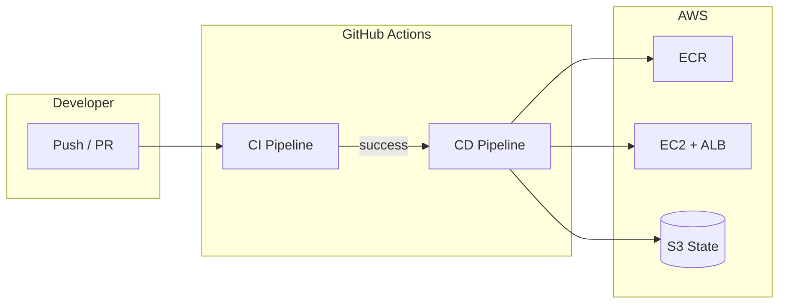
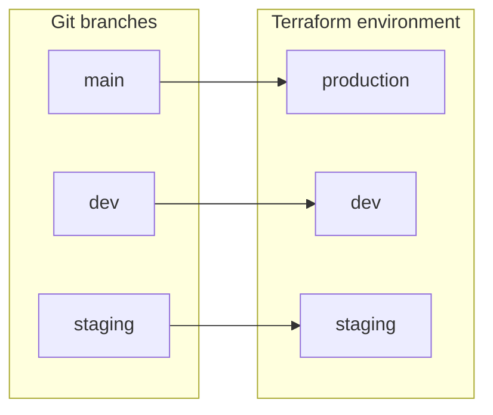
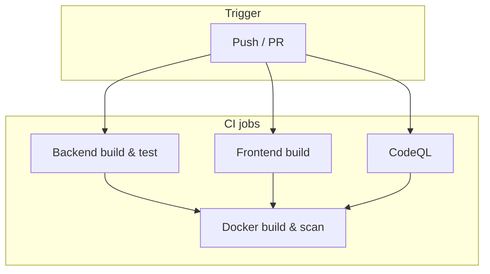
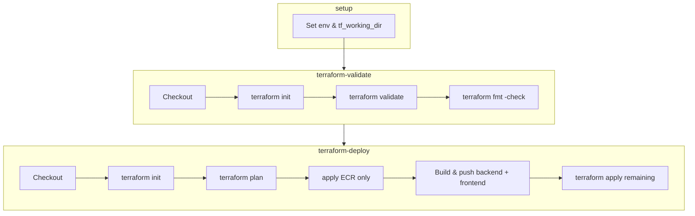
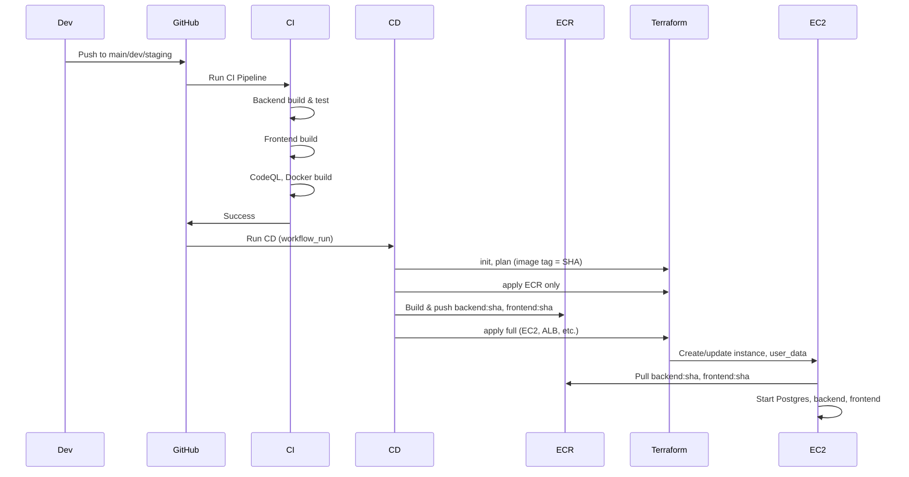
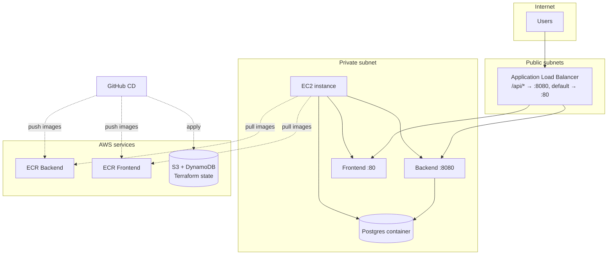
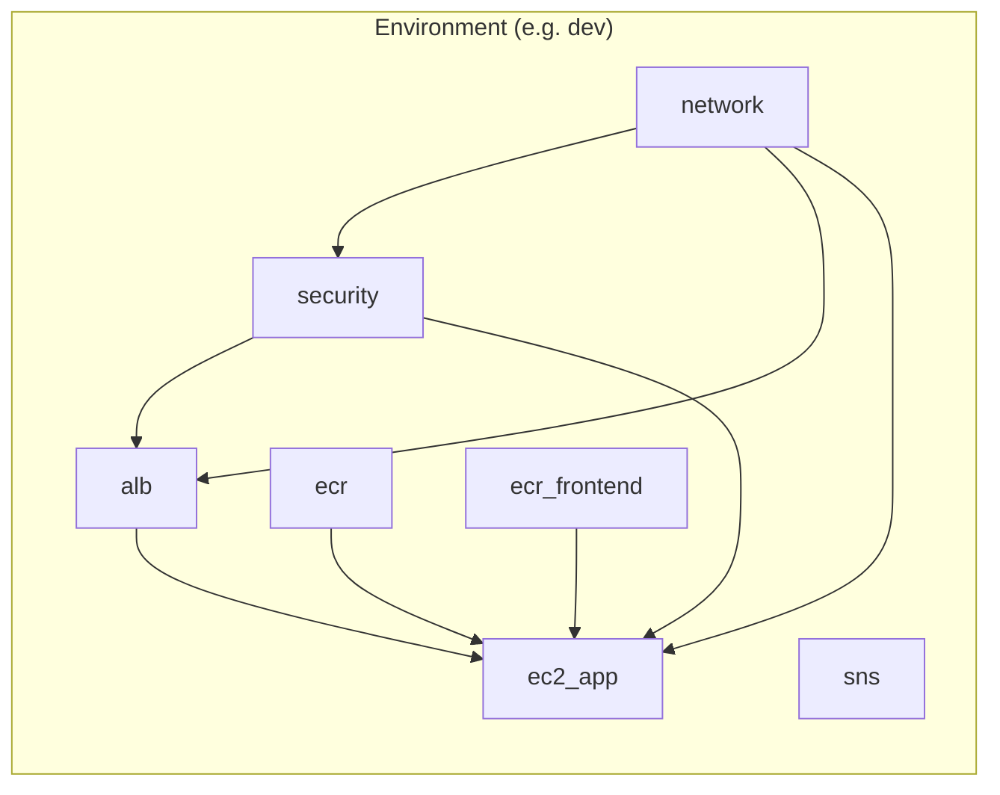
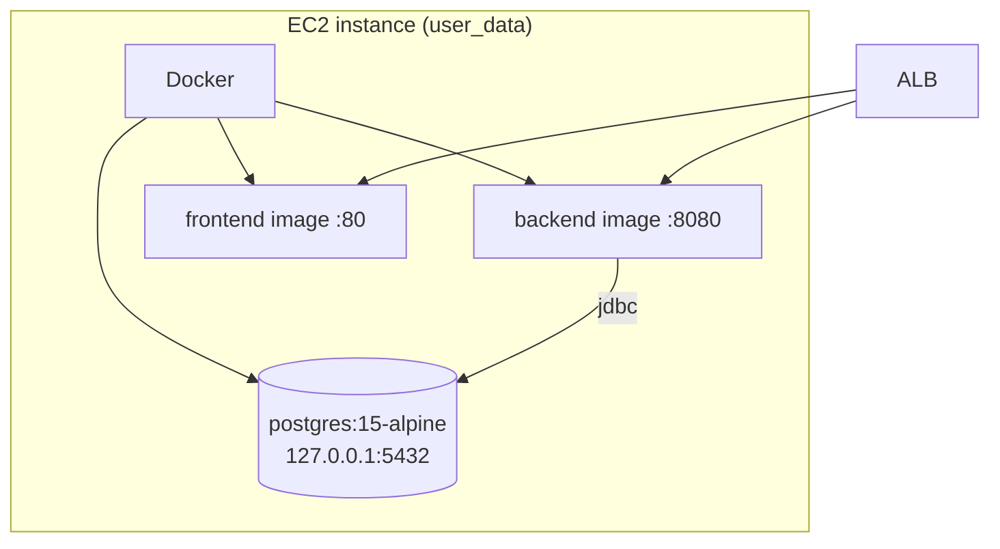

# DevOps – CI/CD & Infrastructure

This folder contains **CI/CD pipelines** (GitHub Actions) and **AWS infrastructure** (Terraform) for the Community Board application. One **ALB** fronts a single **EC2** instance that runs **PostgreSQL**, the **backend** (Spring Boot), and the **frontend** (Nginx). Path-based routing: `/api/`* → backend:8080, default → frontend:80. Terraform state is stored in S3 with DynamoDB locking.

---

## Table of Contents

- [Overview](#overview)
- [Branch and environment mapping](#branch-and-environment-mapping)
- [CI pipeline](#ci-pipeline)
- [CD pipeline](#cd-pipeline)
- [End-to-end deployment flow](#end-to-end-deployment-flow)
- [Infrastructure (Terraform)](#infrastructure-terraform)
- [Repository layout](#repository-layout)
- [Setup steps](#setup-steps)
- [Required secrets & variables](#required-secrets--variables)
- [Local deployment](#local-deployment)
- [Deployment failure causes](#deployment-failure-causes)
- [Runbook](#runbook)

---

## Overview


| Component          | Technology                | Purpose                                                                                                |
| ------------------ | ------------------------- | ------------------------------------------------------------------------------------------------------ |
| **CI**             | GitHub Actions (`ci.yml`) | Build and test backend/frontend; CodeQL; Docker build scan.                                            |
| **CD**             | GitHub Actions (`cd.yml`) | Terraform validate → apply ECR → build & push images → Terraform apply → (optional) SSM deploy on EC2. |
| **Infrastructure** | Terraform (AWS)           | VPC, ALB (/api→backend, default→frontend), EC2 (Postgres + backend + frontend), ECR, SNS.              |
| **State**          | S3 + DynamoDB             | Remote Terraform state with locking.                                                                   |
| **Auth (CD)**      | OIDC                      | GitHub Actions → AWS via `AWS_ROLE_ARN`.                                                               |





---

## Branch and environment mapping

CD runs per branch; the branch name determines the Terraform environment and state key.




| Branch    | Environment | State key                                      |
| --------- | ----------- | ---------------------------------------------- |
| `main`    | production  | `community-board/production/terraform.tfstate` |
| `dev`     | dev         | `community-board/dev/terraform.tfstate`        |
| `staging` | staging     | `community-board/staging/terraform.tfstate`    |


---

## CI pipeline

**Workflow:** `.github/workflows/ci.yml`  
**Triggers:** `push` / `pull_request` to `main`, `dev`, `staging`, `test`.




| Job                   | Description                                                                                               |
| --------------------- | --------------------------------------------------------------------------------------------------------- |
| **backend**           | PostgreSQL 15 service; JDK 17; Maven build (`mvn clean package -DskipTests`); `mvn test` with DB secrets. |
| **frontend**          | Node 20; `npm install`; `npm run build`.                                                                  |
| **codeql**            | CodeQL init/autobuild/analyze for Java + JavaScript.                                                      |
| **docker-build-scan** | Builds backend Docker image; optional Trivy scan (commented out).                                         |


CD runs only when CI completes successfully on `main`, `dev`, or `staging` (`workflow_run`).

---

## CD pipeline

**Workflow:** `.github/workflows/cd.yml`  
**Trigger:** After **CI Pipeline** completes with **success** on `main`, `dev`, or `staging`.




| Job                    | Description                                                                                                                                                                                                               |
| ---------------------- | ------------------------------------------------------------------------------------------------------------------------------------------------------------------------------------------------------------------------- |
| **setup**              | Derives `environment` and `tf_working_dir` from branch; outputs `head_sha`. Runs only if CI conclusion is success.                                                                                                        |
| **terraform-validate** | Init with S3 backend; `terraform validate`; `terraform fmt -check` on repo.                                                                                                                                               |
| **terraform-deploy**   | Plan with image tag = commit SHA; apply ECR only → build & push both images (tag = SHA) → full apply. EC2 user_data uses the same tag; with `user_data_replace_on_change = true`, changing the tag replaces the instance. |


Image tags passed to Terraform are the commit SHA, so each deploy uses new tags and (unless overridden) replaces the EC2 instance. To preserve the database across deploys, use a stable tag (e.g. `latest`) for user_data and run app updates via SSM (see [Deployment failure causes](#deployment-failure-causes)).

---

## End-to-end deployment flow




---

## Infrastructure (Terraform)

### High-level architecture




### Terraform module dependencies

Environments (`dev`, `staging`, `production`) compose the same modules; execution order is implied by references.




| Module                     | Purpose                                                                                                                                                             |
| -------------------------- | ------------------------------------------------------------------------------------------------------------------------------------------------------------------- |
| **network**                | VPC, public/private subnets (2 AZs), IGW, NAT Gateway.                                                                                                              |
| **security**               | ALB security group (80 from internet); app SG (80, 8080 from ALB).                                                                                                  |
| **alb**                    | ALB, listener :80; `/api/`* → backend target group :8080; default → frontend target group :80.                                                                      |
| **ecr** / **ecr_frontend** | ECR repos; lifecycle keep last 10 images.                                                                                                                           |
| **ec2_app**                | Single EC2 (Amazon Linux 2023); IAM (ECR pull); user_data: Docker, Postgres container, backend container, frontend container; registered to both ALB target groups. |
| **sns**                    | Optional alert topic per environment.                                                                                                                               |


### EC2 and containers




- **Postgres:** Same host, Docker network; backend connects via hostname `postgres`.
- **Backend:** Spring Boot; env from Terraform (DB URL, JWT, etc.).
- **Frontend:** Nginx serving static assets; API calls go to same origin (ALB), which routes `/api/`* to backend.

### State and locking

- **Backend:** S3 bucket + DynamoDB table (bootstrap once; see [Setup steps](#setup-steps)).
- **State key:** `community-board/<environment>/terraform.tfstate`.
- **Secrets:** `TF_STATE_BUCKET`, `TF_LOCK_TABLE`, `AWS_REGION` (and OIDC role).

---

## Repository layout

```
devops/
├── README.md                    # This file
├── infra/
│   └── terraform/
│       ├── README.md
│       ├── environments/
│       │   ├── dev/
│       │   ├── staging/
│       │   └── production/
│       └── modules/
│           ├── network/         # VPC, subnets, IGW, NAT
│           ├── security/        # ALB SG, app SG
│           ├── alb/             # ALB, listener, target groups
│           ├── ecr/             # ECR repo (backend)
│           ├── ec2_app/         # EC2, user_data, IAM
│           └── sns/             # Notifications
.github/workflows/
├── ci.yml                       # CI: build, test, CodeQL, Docker
└── cd.yml                       # CD: Terraform + build & push images
```

---

## Setup steps

1. **AWS OIDC for GitHub**
  Create OIDC identity provider and IAM role for the repo; set `AWS_ROLE_ARN` and `AWS_REGION` in GitHub secrets.
2. **Terraform state backend (once)**
  Create S3 bucket and DynamoDB table (e.g. from `devops/infra/terraform/backend` or equivalent). Set `TF_STATE_BUCKET` and `TF_LOCK_TABLE` in GitHub secrets.
3. **GitHub Environments**
  Create **dev**, **staging**, **production**. Optionally add approval for production.
4. **Repository secrets**
  `AWS_ROLE_ARN`, `AWS_REGION`, `TF_STATE_BUCKET`, `TF_LOCK_TABLE`, `TF_VAR_DB_USERNAME`, `TF_VAR_DB_PASSWORD`, `TF_VAR_JWT_SECRET`. For CI: `POSTGRES_USER`, `POSTGRES_PASSWORD`, `SPRING_DATASOURCE_URL`.
5. **Repository variables**
  `TF_VAR_ALERT_EMAIL` (optional).
6. **First deploy**
  Push to `dev` (or `staging` / `main`). After CI succeeds, CD runs and provisions the stack. App URL: `http://<alb_dns_name>` (from Terraform output).

---

## Required secrets & variables


| Name                                                          | Where             | Required | Description                     |
| ------------------------------------------------------------- | ----------------- | -------- | ------------------------------- |
| `AWS_ROLE_ARN`                                                | Repo secret       | Yes      | IAM role ARN for OIDC.          |
| `AWS_REGION`                                                  | Repo secret       | Yes      | AWS region (e.g. `eu-north-1`). |
| `TF_STATE_BUCKET`                                             | Repo secret       | Yes      | S3 bucket for Terraform state.  |
| `TF_LOCK_TABLE`                                               | Repo secret       | Yes      | DynamoDB table for state lock.  |
| `TF_VAR_DB_USERNAME`                                          | Repo/env secret   | Yes      | Postgres username on EC2.       |
| `TF_VAR_DB_PASSWORD`                                          | Repo/env secret   | Yes      | Postgres password.              |
| `TF_VAR_JWT_SECRET`                                           | Repo/env secret   | Yes      | Backend JWT signing secret.     |
| `POSTGRES_USER`, `POSTGRES_PASSWORD`, `SPRING_DATASOURCE_URL` | Repo secret       | Yes (CI) | Used by CI backend tests.       |
| `TF_VAR_ALERT_EMAIL`                                          | Repo/env variable | No       | SNS alert email.                |


Environment-level secrets/variables override repository-level for the deploy job.

---

## Local deployment

Without AWS or GitHub Actions:

```bash
./devops/scripts/deploy.sh [environment]
# default: development
```

Uses `docker-compose`: backend :8080, frontend :3000, Postgres.

---

## Deployment failure causes


| Cause                      | Symptom                        | Fix                                                                       |
| -------------------------- | ------------------------------ | ------------------------------------------------------------------------- |
| **Missing GitHub secrets** | Plan/apply fails or empty vars | Set required repo (or env) secrets.                                       |
| **CI did not succeed**     | CD never runs                  | CD runs only after successful CI on main/dev/staging.                     |
| **Wrong branch**           | CD not triggered               | Push/merge to main, dev, or staging.                                      |
| **Terraform fmt**          | Validate job fails             | Run `terraform fmt -recursive` under `devops/infra/terraform` and commit. |
| **ECR / push order**       | Images not found on EC2        | Run full CD (ECR apply → build & push → apply remaining).                 |
| **No NAT / no outbound**   | EC2 cannot pull ECR            | Ensure private subnet has NAT and route to 0.0.0.0/0.                     |
                                                                                                                            


---

## Runbook

1. **First-time Terraform**
  Bootstrap S3 + DynamoDB for state; configure OIDC; set CD secrets/vars; push to dev/staging/main to run CD.
2. **Redeploy app (code change)**
  Push to the branch for the env. CI runs; on success CD runs: build & push images (tag = SHA), Terraform apply. If user_data tag changes, EC2 is replaced (new instance, new Postgres data unless you use stable tag + in-place deploy).
3. **Terraform-only change**
  Change Terraform under `devops/infra/terraform/environments/<env>` and push. CI then CD runs; image tags unchanged if same commit.
4. **Local dev**
  Use `devops/scripts/deploy.sh`; no Terraform or GitHub Actions.
5. **Backend can't connect to Postgres**
  Check EC2 user_data: Postgres container must be up before backend; same Docker network and credentials as in Terraform (DB username/password). Check ALB target group health (e.g. `/api/categories`); ensure app SG allows 80 and 8080 from ALB.
