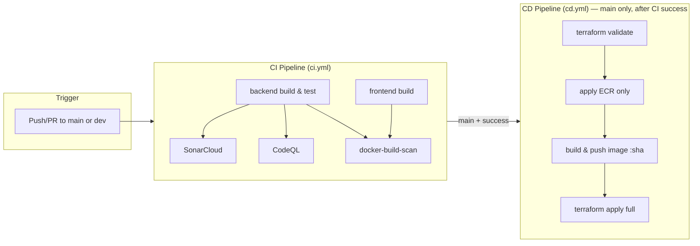
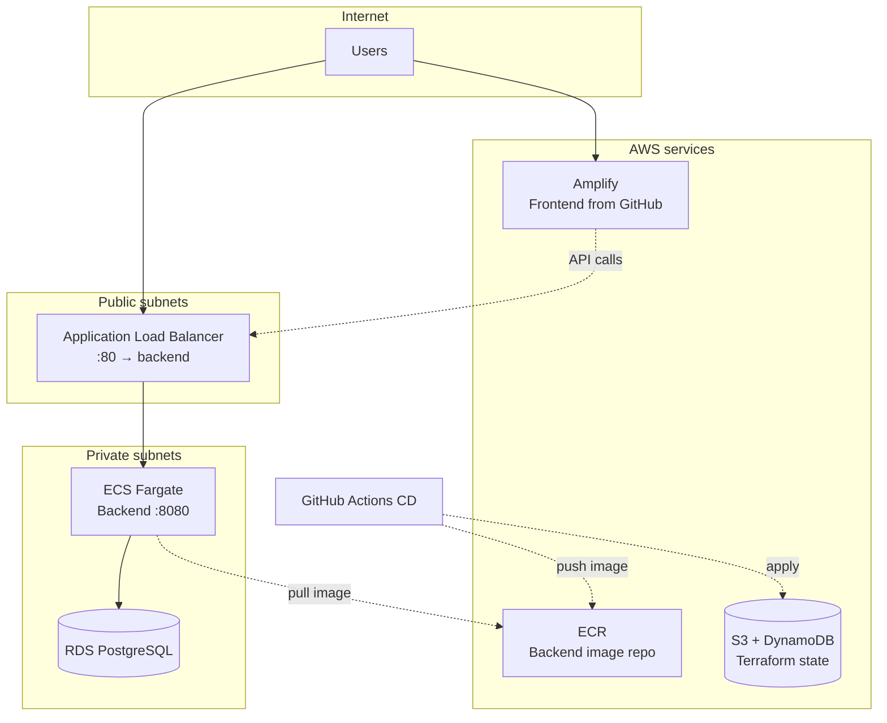

# DevOps – CI/CD & Infrastructure

This folder contains the **CI/CD pipelines** (GitHub Actions) and **AWS infrastructure** (Terraform) for the Community Board application. The backend runs on ECS Fargate behind an ALB; the frontend is hosted on AWS Amplify; state and data use S3 (Terraform state) and RDS PostgreSQL.

---

## Table of Contents

- [Setup steps](#setup-steps)
- [Overview](#overview)
- [Architecture Diagrams](#architecture-diagrams)
- [Repository Layout](#repository-layout)
- [CI Pipeline](#ci-pipeline)
- [CD Pipeline](#cd-pipeline)
- [Infrastructure (Terraform)](#infrastructure-terraform)
- [Local Deployment](#local-deployment)
- [Backend for all environments](#backend-for-all-environments)
- [Required Secrets & Variables](#required-secrets--variables)
- [Runbook](#runbook)

---

## Setup steps

Follow in order to get CI/CD and all environments (dev, staging, production) running.

### 1. AWS: OIDC for GitHub Actions

- In **AWS IAM**, create an OIDC identity provider for GitHub (e.g. `token.actions.githubusercontent.com`).
- Create an IAM role that:
  - Trusts the GitHub OIDC provider (with your repo/org in the condition).
  - Has permissions for: S3 (state bucket), DynamoDB (lock table), ECR, ECS, RDS, Amplify, VPC/ALB, etc. (or use a policy that matches what Terraform needs).
- Note the role **ARN** → you’ll set it as GitHub secret `AWS_ROLE_ARN`.

### 2. Terraform state backend (once, for all environments)

```bash
cd devops/infra/terraform/backend
cp terraform.tfvars.example terraform.tfvars
# Edit: state_bucket_name (globally unique), lock_table_name, aws_region
terraform init
terraform apply
```

- From the output, note **state_bucket_name** and **lock_table_name** for the next step.

### 3. GitHub: Environments

- Repo **Settings → Environments → New environment**.
- Create: **dev**, **staging**, **production**.
- (Optional) On **production**, add required reviewers or a wait timer.

### 4. GitHub: Repository secrets

- Repo **Settings → Secrets and variables → Actions → Secrets → New repository secret**.
- Add these (shared by CD for all environments; can be overridden per environment if you set the same name under **Environments → [dev|staging|production] → Environment secrets**):

| Secret | Required | Description |
|--------|----------|-------------|
| `AWS_ROLE_ARN` | Yes | IAM role ARN for OIDC (GitHub → AWS). |
| `AWS_REGION` | Yes | AWS region (e.g. `eu-north-1`). |
| `TF_STATE_BUCKET` | Yes | S3 bucket name (from backend bootstrap output). |
| `TF_LOCK_TABLE` | Yes | DynamoDB table name (from backend bootstrap output). |
| `TF_VAR_DB_USERNAME` | Yes | RDS master username (or set per env under Environments). |
| `TF_VAR_DB_PASSWORD` | Yes | RDS master password (or set per env). |
| `TF_VAR_JWT_SECRET` | Yes | Backend JWT signing secret (or set per env). |
| `TF_VAR_GITHUB_TOKEN` | No | For Amplify private repo (or set per env). |

### 5. GitHub: Environment secrets (optional overrides)

- To use **different** DB credentials or JWT per environment: **Settings → Environments → [dev | staging | production] → Environment secrets**.
- Add the same secret names (e.g. `TF_VAR_DB_USERNAME`, `TF_VAR_DB_PASSWORD`, `TF_VAR_JWT_SECRET`). The deploy job uses `environment: ${{ env.ENVIRONMENT }}`, so it reads that environment’s secrets; environment values override repository secrets.

### 6. GitHub: Repository variables

- **Settings → Secrets and variables → Actions → Variables**.
- These are **repository-level** (same value for all environments unless you add environment-specific variables):

| Variable | Required | Description |
|----------|----------|-------------|
| `TF_VAR_REPO_URL` | Yes | GitHub repo URL for Amplify (e.g. `https://github.com/org/repo`). |
| `TF_VAR_API_URL` | No | Backend API URL for frontend; set after first apply (ALB DNS) or leave empty. |
| `TF_VAR_ALERT_EMAIL` | No | Email for SNS alerts; empty = no subscription. |

### 7. GitHub: Environment variables (optional overrides)

- **Settings → Environments → [dev | staging | production] → Environment variables**.
- Use when a variable must differ per env (e.g. different `TF_VAR_API_URL` or `TF_VAR_ALERT_EMAIL` per environment). Same names as repository variables; environment value overrides repo.

### 8. CI secrets (repository)

- **Settings → Secrets and variables → Actions → Secrets**.
- Used by **CI** (build/test): `POSTGRES_USER`, `POSTGRES_PASSWORD`, `SPRING_DATASOURCE_URL`. Optional: `SONAR_TOKEN` (and Sonar vars if you use SonarCloud).

### 9. First deploy

- Push to **dev** / **staging** / **main**. CI runs, then CD runs for that branch’s environment.
- After first apply, set **TF_VAR_API_URL** (repo or per env) to the ALB URL if the frontend needs it.

---

## Overview

| Component        | Technology              | Purpose                                      |
|-----------------|-------------------------|----------------------------------------------|
| **CI**          | GitHub Actions (`ci.yml`) | Build, test, scan backend/frontend; build Docker image |
| **CD**          | GitHub Actions (`cd.yml`) | Terraform validate → plan → apply; build & push image to ECR; deploy |
| **Infrastructure** | Terraform (AWS)       | VPC, ALB, ECS, ECR, RDS, Amplify, security groups |
| **State**       | S3 + DynamoDB          | Remote Terraform state with locking          |
| **Auth (CD)**   | OIDC                    | GitHub Actions → AWS via `AWS_ROLE_ARN`      |

**Flow:** Push to `main`/`dev` → **CI** runs (build, test, SonarCloud, CodeQL, Docker build). On **main**, when CI succeeds → **CD** runs: Terraform validate → apply ECR only → build & push backend image (tag = commit SHA) → Terraform apply full stack. ECS pulls the new image; Amplify builds the frontend from the repo.

---

## Architecture Diagrams

### CI/CD pipeline flow



### AWS infrastructure (Terraform)



---

## Repository Layout

```
devops/
├── README.md                 # This file
├── infra/
│   └── terraform/            # Root Terraform (calls modules)
│       ├── main.tf           # Module wiring (network → security → alb → rds → ecr → ecs → amplify)
│       ├── variables.tf
│       ├── outputs.tf
│       ├── providers.tf
│       ├── versions.tf       # Backend S3 + lock table
│       ├── terraform.tfvars.example
│       └── modules/
│           ├── network/      # VPC, public/private subnets, IGW, NAT
│           ├── security/     # ALB, backend, RDS security groups
│           ├── alb/          # ALB, target group, HTTP listener
│           ├── rds/          # PostgreSQL in private subnets
│           ├── ecr/          # ECR repo + lifecycle (keep last 10)
│           ├── ecs/          # Fargate cluster, task def, service, CloudWatch logs
│           └── amplify/      # Amplify app + main branch, build spec
 

.github/workflows/
├── ci.yml                    # CI: backend/frontend build & test, Sonar, CodeQL, Docker build
└── cd.yml                    # CD: Terraform validate → plan → apply; ECR push; full apply
```

---

## CI Pipeline

**Workflow:** `.github/workflows/ci.yml`  
**Triggers:** `push` / `pull_request` to `main` or `dev` (and PRs targeting `main`).

| Job                 | Runs on    | Description |
|---------------------|------------|-------------|
| **backend**         | ubuntu-latest | PostgreSQL 15 service; JDK 17; Maven build (`mvn clean package -DskipTests`); then `mvn test` with DB secrets. |
| **frontend**        | ubuntu-latest | Node 18; `npm ci`; `npm run build` in `frontend/`. |
| **sonar**           | After backend | SonarCloud (or SonarQube) scan on backend; uses `SONAR_TOKEN`, optional `SONAR_HOST_URL`, `SONAR_PROJECT_KEY`, `SONAR_ORGANIZATION`. |
| **codeql**          | ubuntu-latest | CodeQL init/autobuild/analyze for Java + JavaScript. |
| **docker-build-scan** | After backend, frontend, sonar, codeql | Builds backend Docker image `communityboard-backend:${{ github.sha }}`. Trivy scan is present but commented out. |

**Secrets used (CI):** `POSTGRES_USER`, `POSTGRES_PASSWORD`, `SPRING_DATASOURCE_URL`, `SONAR_TOKEN`.  
**Variables (optional):** `SONAR_PROJECT_KEY`, `SONAR_ORGANIZATION`, `SONAR_HOST_URL`.

---

## CD Pipeline

**Workflow:** `.github/workflows/cd.yml`  
**Trigger:** Runs after **CI Pipeline** completes on branch **main** (`workflow_run`). Only runs when CI conclusion is **success**.  
**Working directory:** `devops/infra/terraform` (`TF_WORKING_DIR`).

### Jobs

1. **terraform-validate**
   - Checkout → Setup Terraform 1.5 → Configure AWS via OIDC (`AWS_ROLE_ARN`, `AWS_REGION`).
   - `terraform init` with S3 backend (bucket, key, region, DynamoDB lock table from secrets).
   - `terraform validate` and `terraform fmt -check -recursive`.

2. **terraform-deploy** (needs `terraform-validate`, same CI success condition)
   - Uses **production** environment.
   - Terraform init (same backend).
   - **Plan** with:
     - `TF_VAR_backend_image_tag` = `github.event.workflow_run.head_sha` (commit that triggered CI).
     - Other TF vars from secrets/vars (DB, JWT, repo URL, API URL, GitHub token).
   - **Apply ECR only:** `terraform apply -target=module.ecr` so the repository exists before push.
   - **Login to ECR** → **Build & push** backend image:  
     `$ECR_REGISTRY/$ECR_REPO_NAME:${{ github.event.workflow_run.head_sha }}` (from `./backend`).
   - **Full apply:** `terraform apply` so ECS, ALB, RDS, Amplify, etc. use the new image and config.

**Important:** ECR is applied first so the CD job can push the image; the rest of the stack (ECS, ALB, RDS, Amplify) is applied after the image is in ECR. ECS uses `ecr_repository_url:backend_image_tag` (tag = commit SHA).

---

## Infrastructure (Terraform)

### Architecture

- **VPC** (e.g. `10.0.0.0/16`): public and private subnets in 2 AZs; IGW for public; NAT Gateway for private outbound (e.g. ECR pull).
- **Security groups:** ALB (80/443 from internet) → Backend (8080 from ALB) → RDS (5432 from backend). No direct internet to backend or RDS.
- **ALB:** Public; HTTP listener → backend target group (port 8080); health check e.g. `/api/categories`.
- **RDS:** PostgreSQL 15, `db.t3.micro`, private subnets, not publicly accessible.
- **ECR:** One repository; lifecycle policy keeps last 10 images.
- **ECS:** Fargate cluster; single task definition (backend container, env: DB URL, JWT, etc.); service with desired count 1; logs to CloudWatch.
- **Amplify:** App connected to GitHub repo; `main` branch with auto build; build spec: `frontend` directory, `npm install` / `npm run build`; SPA fallback rules; `API_URL` from Terraform (e.g. ALB URL).

### State & Lock

- **Backend:** S3 bucket + DynamoDB table (see `versions.tf`: bucket, key, `dynamodb_table`, encrypt).
- In CI/CD, backend config is passed via secrets: `TF_STATE_BUCKET`, `TF_STATE_KEY`, `AWS_REGION`, `TF_LOCK_TABLE`.

### Apply order (in code)

1. **network** → **security** → **alb**, **rds**, **ecr** (no cross-deps between these).
2. **ecs** (depends on ALB target group, security, ECR image, RDS).
3. **amplify** (depends on repo URL and optional `api_url`).

### Variables

- **Required (no default):** `db_username`, `db_password`, `repo_url`; sensitive: `jwt_secret`.
- **Optional/sensitive:** `github_token` (Amplify private repo).
- **Backend image:** If `backend_image` is not set, image is `ecr_repository_url:backend_image_tag` (CD sets `backend_image_tag` to commit SHA).
- See `terraform.tfvars.example` and `infra/terraform/README.md` for full list and examples.

### Outputs

- `vpc_id`, `alb_dns_name`, `alb_zone_id`
- `rds_endpoint` (sensitive)
- `ecs_cluster_name`, `ecs_service_name`
- `ecr_repository_url`, `backend_image_url`

---

## Local Deployment

For local dev (no AWS):

```bash
./devops/scripts/deploy.sh [environment]
# default environment: development
```

This runs `docker-compose down`, `docker-compose build --no-cache`, `docker-compose up -d`, then a simple health check against `http://localhost:8080/api-docs`. Backend at 8080, frontend at 3000.

---

## Backend for all environments

Terraform state for **dev**, **staging**, and **production** uses one shared **S3 bucket** and one **DynamoDB** lock table. You create them once; each environment uses a different state **key** in the same bucket.

### 1. Create the backend (one-time)

```bash
cd devops/infra/terraform/backend
cp terraform.tfvars.example terraform.tfvars
# Edit: state_bucket_name (globally unique), lock_table_name, aws_region
terraform init
terraform apply
```

Details: **[infra/terraform/backend/README.md](infra/terraform/backend/README.md)**.

### 2. Set GitHub secrets from backend outputs

After `terraform apply`, use the outputs:

| Secret | Value (from backend apply output) |
|--------|-----------------------------------|
| `TF_STATE_BUCKET` | `state_bucket_name` |
| `TF_LOCK_TABLE`   | `lock_table_name`   |

In GitHub: **Settings → Secrets and variables → Actions → New repository secret** (or set per environment under **Settings → Environments**).

### 3. State keys (no secret needed)

CD derives the state key from the environment:

- **dev** → `community-board/dev/terraform.tfstate`
- **staging** → `community-board/staging/terraform.tfstate`
- **production** → `community-board/production/terraform.tfstate`

---

## Required Secrets & Variables

All names used by CI/CD, with **where** to set them (repository vs environment) and **required** vs optional. Environment-level values override repository-level when the deploy job runs with `environment: dev | staging | production`.

### Repository secrets (shared; used by CD and optionally by CI)

Set under **Settings → Secrets and variables → Actions → Secrets**.

| Secret | Required | Used by | Description |
|--------|----------|---------|-------------|
| `AWS_ROLE_ARN` | Yes | CD | IAM role ARN for OIDC (GitHub → AWS). |
| `AWS_REGION` | Yes | CD | AWS region (e.g. `eu-north-1`). |
| `TF_STATE_BUCKET` | Yes | CD | S3 bucket for Terraform state (from backend bootstrap). |
| `TF_LOCK_TABLE` | Yes | CD | DynamoDB table for state lock (from backend bootstrap). |
| `TF_VAR_DB_USERNAME` | Yes | CD | RDS master username. |
| `TF_VAR_DB_PASSWORD` | Yes | CD | RDS master password. |
| `TF_VAR_JWT_SECRET` | Yes | CD | Backend JWT signing secret. |
| `TF_VAR_GITHUB_TOKEN` | No | CD | For Amplify private repo. |
| `POSTGRES_USER` | Yes | CI | Postgres user for CI test DB. |
| `POSTGRES_PASSWORD` | Yes | CI | Postgres password for CI test DB. |
| `SPRING_DATASOURCE_URL` | Yes | CI | JDBC URL for CI tests (e.g. `jdbc:postgresql://localhost:5432/communityboard`). |
| `SONAR_TOKEN` | No | CI | Only if using SonarCloud/SonarQube. |

### Environment secrets (per dev / staging / production)

Set under **Settings → Environments → [dev | staging | production] → Environment secrets**.

Use these when a value must **differ per environment** (e.g. different RDS credentials or JWT per env). Same names as in the table above; environment secret overrides repository secret for the deploy job.

| Secret | When to use per env |
|--------|----------------------|
| `TF_VAR_DB_USERNAME` | Different DB user per env. |
| `TF_VAR_DB_PASSWORD` | Different DB password per env. |
| `TF_VAR_JWT_SECRET` | Different JWT secret per env. |
| `TF_VAR_GITHUB_TOKEN` | Different token per env (e.g. production only). |

### Repository variables (shared; used by CD)

Set under **Settings → Secrets and variables → Actions → Variables**.

| Variable | Required | Used by | Description |
|----------|----------|---------|-------------|
| `TF_VAR_REPO_URL` | Yes | CD | GitHub repo URL for Amplify (e.g. `https://github.com/org/repo`). |
| `TF_VAR_API_URL` | No | CD | Backend API URL for frontend (e.g. ALB URL); set after first apply. |
| `TF_VAR_ALERT_EMAIL` | No | CD | Email for SNS alerts; empty = no subscription. |

### Environment variables (per dev / staging / production)

Set under **Settings → Environments → [dev | staging | production] → Environment variables**.

Use when a variable must **differ per environment** (e.g. different API URL or alert email per env). Same names as above; environment variable overrides repository variable.

| Variable | When to use per env |
|----------|----------------------|
| `TF_VAR_REPO_URL` | Different Amplify repo per env (rare). |
| `TF_VAR_API_URL` | Different ALB URL per env (typical: dev/staging/prod each have own ALB). |
| `TF_VAR_ALERT_EMAIL` | Different alert email per env. |

### Summary

- **Repository** = one value for the whole repo; use for shared config (AWS, state backend, shared DB/JWT, repo URL).
- **Environment** = one value per GitHub Environment (dev, staging, production); use for env-specific config (different DB, JWT, API URL, alert email). The CD deploy job uses `environment: ${{ env.ENVIRONMENT }}`, so it reads that environment’s secrets and variables.
- **Secrets** = sensitive (passwords, tokens, JWT). **Variables** = non-sensitive (URLs, emails); can still be overridden per environment.
- State key is **not** stored as a secret; CD derives it as `community-board/<env>/terraform.tfstate`. ECR repo name is derived as `communityboard-backend-<env>`.

---

## Runbook

1. **First-time Terraform (e.g. new account)**  
   Create S3 bucket and DynamoDB table for state; configure OIDC in AWS for GitHub; set CD secrets/vars; ensure `ECR_REPO_NAME` matches Terraform `ecr_repository_name`.

2. **Redeploy backend only**  
   Push to `main`; CI passes → CD runs and pushes new image (tag = SHA) and runs full Terraform apply. ECS pulls the new image.

3. **Redeploy frontend only**  
   Amplify builds from `main` on repo changes; ensure `TF_VAR_API_URL` (or Amplify env) points to the correct ALB URL.

4. **Terraform changes only (no app code)**  
   Change Terraform under `devops/infra/terraform` and push to `main`. CI still runs; CD runs Terraform with same image tag as last run (no new image push if Dockerfile/backend unchanged).

5. **Local dev**  
   Use `devops/scripts/deploy.sh`; no Terraform or GitHub Actions required.

6. **ECS backend can't connect to RDS**  
   - **Security groups:** RDS SG must allow ingress 5432 from the **backend** SG (Terraform does this). In AWS Console → RDS → instance → VPC security groups, confirm the RDS SG has a rule “Postgres from backend” with source = backend SG.  
   - **Credentials:** Ensure `TF_VAR_DB_USERNAME` and `TF_VAR_DB_PASSWORD` match the RDS master user/password (and are set for the same GitHub Environment as the deploy).  
   - **RDS not ready:** After first apply, RDS can stay in “creating” for a few minutes. If tasks fail immediately, wait until RDS status is “Available”, then force a new ECS deployment (ECS → Service → Update → Force new deployment).  
   - **SSL:** If the app fails with an SSL-related error, set the ECS module variable `db_connection_params` to `?sslmode=disable` (same-VPC) or `?sslmode=require` (if RDS enforces SSL). Add the variable in the environment’s `main.tf` (e.g. `db_connection_params = "?sslmode=disable"`) or via `TF_VAR_db_connection_params` in CD.  
   - **Logs:** Check CloudWatch log group `/ecs/<project_name>-backend` for the exact connection error (e.g. timeout vs auth vs SSL).

For more detail on Terraform modules and variables, see **`devops/infra/terraform/README.md`**.
