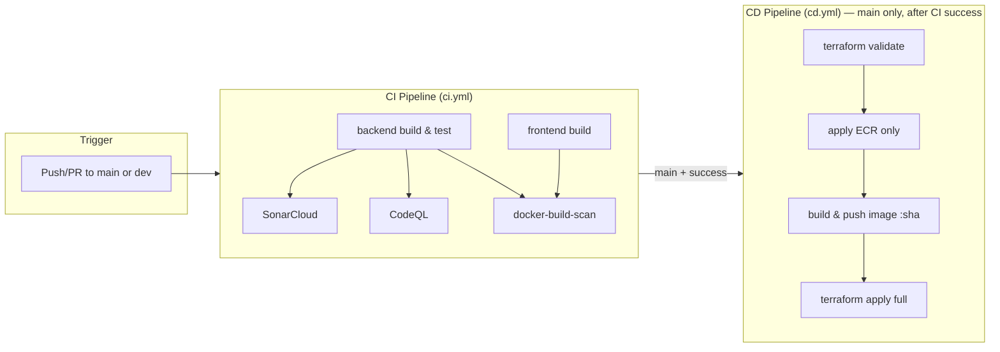
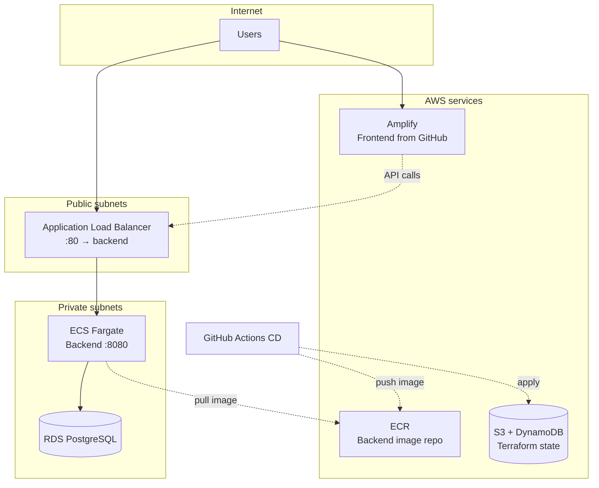

# DevOps – CI/CD & Infrastructure

This folder contains the **CI/CD pipelines** (GitHub Actions) and **AWS infrastructure** (Terraform) for the Community Board application. The backend runs on ECS Fargate behind an ALB; the frontend is hosted on AWS Amplify; state and data use S3 (Terraform state) and RDS PostgreSQL.

---

## Table of Contents

- [Overview](#overview)
- [Architecture Diagrams](#architecture-diagrams)
- [Repository Layout](#repository-layout)
- [CI Pipeline](#ci-pipeline)
- [CD Pipeline](#cd-pipeline)
- [Infrastructure (Terraform)](#infrastructure-terraform)
- [Local Deployment](#local-deployment)
- [Required Secrets & Variables](#required-secrets--variables)
- [Runbook](#runbook)

---

## Overview

| Component        | Technology              | Purpose                                      |
|-----------------|-------------------------|----------------------------------------------|
| **CI**          | GitHub Actions (`ci.yml`) | Build, test, scan backend/frontend; build Docker image |
| **CD**          | GitHub Actions (`cd.yml`) | Terraform validate → plan → apply; build & push image to ECR; deploy |
| **Infrastructure** | Terraform (AWS)       | VPC, ALB, ECS, ECR, RDS, Amplify, security groups |
| **State**       | S3 + DynamoDB          | Remote Terraform state with locking          |
| **Auth (CD)**   | OIDC                    | GitHub Actions → AWS via `AWS_ROLE_ARN`      |

**Flow:** Push to `main`/`dev` → **CI** runs (build, test, SonarCloud, CodeQL, Docker build). On **main**, when CI succeeds → **CD** runs: Terraform validate → apply ECR only → build & push backend image (tag = commit SHA) → Terraform apply full stack. ECS pulls the new image; Amplify builds the frontend from the repo.

---

## Architecture Diagrams

### CI/CD pipeline flow



### AWS infrastructure (Terraform)



---

## Repository Layout

```
devops/
├── README.md                 # This file
├── infra/
│   └── terraform/            # Root Terraform (calls modules)
│       ├── main.tf           # Module wiring (network → security → alb → rds → ecr → ecs → amplify)
│       ├── variables.tf
│       ├── outputs.tf
│       ├── providers.tf
│       ├── versions.tf       # Backend S3 + lock table
│       ├── terraform.tfvars.example
│       └── modules/
│           ├── network/      # VPC, public/private subnets, IGW, NAT
│           ├── security/     # ALB, backend, RDS security groups
│           ├── alb/          # ALB, target group, HTTP listener
│           ├── rds/          # PostgreSQL in private subnets
│           ├── ecr/          # ECR repo + lifecycle (keep last 10)
│           ├── ecs/          # Fargate cluster, task def, service, CloudWatch logs
│           └── amplify/      # Amplify app + main branch, build spec
 

.github/workflows/
├── ci.yml                    # CI: backend/frontend build & test, Sonar, CodeQL, Docker build
└── cd.yml                    # CD: Terraform validate → plan → apply; ECR push; full apply
```

---

## CI Pipeline

**Workflow:** `.github/workflows/ci.yml`  
**Triggers:** `push` / `pull_request` to `main` or `dev` (and PRs targeting `main`).

| Job                 | Runs on    | Description |
|---------------------|------------|-------------|
| **backend**         | ubuntu-latest | PostgreSQL 15 service; JDK 17; Maven build (`mvn clean package -DskipTests`); then `mvn test` with DB secrets. |
| **frontend**        | ubuntu-latest | Node 18; `npm ci`; `npm run build` in `frontend/`. |
| **sonar**           | After backend | SonarCloud (or SonarQube) scan on backend; uses `SONAR_TOKEN`, optional `SONAR_HOST_URL`, `SONAR_PROJECT_KEY`, `SONAR_ORGANIZATION`. |
| **codeql**          | ubuntu-latest | CodeQL init/autobuild/analyze for Java + JavaScript. |
| **docker-build-scan** | After backend, frontend, sonar, codeql | Builds backend Docker image `communityboard-backend:${{ github.sha }}`. Trivy scan is present but commented out. |

**Secrets used (CI):** `POSTGRES_USER`, `POSTGRES_PASSWORD`, `SPRING_DATASOURCE_URL`, `SONAR_TOKEN`.  
**Variables (optional):** `SONAR_PROJECT_KEY`, `SONAR_ORGANIZATION`, `SONAR_HOST_URL`.

---

## CD Pipeline

**Workflow:** `.github/workflows/cd.yml`  
**Trigger:** Runs after **CI Pipeline** completes on branch **main** (`workflow_run`). Only runs when CI conclusion is **success**.  
**Working directory:** `devops/infra/terraform` (`TF_WORKING_DIR`).

### Jobs

1. **terraform-validate**
   - Checkout → Setup Terraform 1.5 → Configure AWS via OIDC (`AWS_ROLE_ARN`, `AWS_REGION`).
   - `terraform init` with S3 backend (bucket, key, region, DynamoDB lock table from secrets).
   - `terraform validate` and `terraform fmt -check -recursive`.

2. **terraform-deploy** (needs `terraform-validate`, same CI success condition)
   - Uses **production** environment.
   - Terraform init (same backend).
   - **Plan** with:
     - `TF_VAR_backend_image_tag` = `github.event.workflow_run.head_sha` (commit that triggered CI).
     - Other TF vars from secrets/vars (DB, JWT, repo URL, API URL, GitHub token).
   - **Apply ECR only:** `terraform apply -target=module.ecr` so the repository exists before push.
   - **Login to ECR** → **Build & push** backend image:  
     `$ECR_REGISTRY/$ECR_REPO_NAME:${{ github.event.workflow_run.head_sha }}` (from `./backend`).
   - **Full apply:** `terraform apply` so ECS, ALB, RDS, Amplify, etc. use the new image and config.

**Important:** ECR is applied first so the CD job can push the image; the rest of the stack (ECS, ALB, RDS, Amplify) is applied after the image is in ECR. ECS uses `ecr_repository_url:backend_image_tag` (tag = commit SHA).

---

## Infrastructure (Terraform)

### Architecture

- **VPC** (e.g. `10.0.0.0/16`): public and private subnets in 2 AZs; IGW for public; NAT Gateway for private outbound (e.g. ECR pull).
- **Security groups:** ALB (80/443 from internet) → Backend (8080 from ALB) → RDS (5432 from backend). No direct internet to backend or RDS.
- **ALB:** Public; HTTP listener → backend target group (port 8080); health check e.g. `/api/categories`.
- **RDS:** PostgreSQL 15, `db.t3.micro`, private subnets, not publicly accessible.
- **ECR:** One repository; lifecycle policy keeps last 10 images.
- **ECS:** Fargate cluster; single task definition (backend container, env: DB URL, JWT, etc.); service with desired count 1; logs to CloudWatch.
- **Amplify:** App connected to GitHub repo; `main` branch with auto build; build spec: `frontend` directory, `npm install` / `npm run build`; SPA fallback rules; `API_URL` from Terraform (e.g. ALB URL).

### State & Lock

- **Backend:** S3 bucket + DynamoDB table (see `versions.tf`: bucket, key, `dynamodb_table`, encrypt).
- In CI/CD, backend config is passed via secrets: `TF_STATE_BUCKET`, `TF_STATE_KEY`, `AWS_REGION`, `TF_LOCK_TABLE`.

### Apply order (in code)

1. **network** → **security** → **alb**, **rds**, **ecr** (no cross-deps between these).
2. **ecs** (depends on ALB target group, security, ECR image, RDS).
3. **amplify** (depends on repo URL and optional `api_url`).

### Variables

- **Required (no default):** `db_username`, `db_password`, `repo_url`; sensitive: `jwt_secret`.
- **Optional/sensitive:** `github_token` (Amplify private repo).
- **Backend image:** If `backend_image` is not set, image is `ecr_repository_url:backend_image_tag` (CD sets `backend_image_tag` to commit SHA).
- See `terraform.tfvars.example` and `infra/terraform/README.md` for full list and examples.

### Outputs

- `vpc_id`, `alb_dns_name`, `alb_zone_id`
- `rds_endpoint` (sensitive)
- `ecs_cluster_name`, `ecs_service_name`
- `ecr_repository_url`, `backend_image_url`

---

## Local Deployment

For local dev (no AWS):

```bash
./devops/scripts/deploy.sh [environment]
# default environment: development
```

This runs `docker-compose down`, `docker-compose build --no-cache`, `docker-compose up -d`, then a simple health check against `http://localhost:8080/api-docs`. Backend at 8080, frontend at 3000.

---

## Required Secrets & Variables

### GitHub Actions – CD (and Terraform in CI)

| Secret / Var       | Where   | Description |
|--------------------|--------|-------------|
| `AWS_ROLE_ARN`     | Secrets | IAM role ARN for OIDC (GitHub → AWS). |
| `AWS_REGION`       | Secrets | e.g. `eu-north-1`. |
| `TF_STATE_BUCKET`  | Secrets | S3 bucket for Terraform state. |
| `TF_STATE_KEY`     | Secrets | State object key (e.g. `community-board/terraform.tfstate`). |
| `TF_LOCK_TABLE`    | Secrets | DynamoDB table for state lock. |
| `TF_VAR_DB_USERNAME` | Secrets | RDS master user. |
| `TF_VAR_DB_PASSWORD` | Secrets | RDS master password. |
| `TF_VAR_JWT_SECRET`  | Secrets | Backend JWT signing secret. |
| `TF_VAR_GITHUB_TOKEN` | Secrets | Optional; Amplify private repo. |
| `TF_VAR_REPO_URL`  | Vars    | GitHub repo URL for Amplify. |
| `TF_VAR_API_URL`   | Vars    | Backend API URL for frontend (e.g. ALB URL). |
| `ECR_REPO_NAME`    | Vars    | ECR repository name (e.g. `communityboard-backend`); must match Terraform `ecr_repository_name`. |

### GitHub Actions – CI

- `POSTGRES_USER`, `POSTGRES_PASSWORD`, `SPRING_DATASOURCE_URL`, `SONAR_TOKEN`.
- Optional: `SONAR_HOST_URL`, `SONAR_PROJECT_KEY`, `SONAR_ORGANIZATION`.

---

## Runbook

1. **First-time Terraform (e.g. new account)**  
   Create S3 bucket and DynamoDB table for state; configure OIDC in AWS for GitHub; set CD secrets/vars; ensure `ECR_REPO_NAME` matches Terraform `ecr_repository_name`.

2. **Redeploy backend only**  
   Push to `main`; CI passes → CD runs and pushes new image (tag = SHA) and runs full Terraform apply. ECS pulls the new image.

3. **Redeploy frontend only**  
   Amplify builds from `main` on repo changes; ensure `TF_VAR_API_URL` (or Amplify env) points to the correct ALB URL.

4. **Terraform changes only (no app code)**  
   Change Terraform under `devops/infra/terraform` and push to `main`. CI still runs; CD runs Terraform with same image tag as last run (no new image push if Dockerfile/backend unchanged).

5. **Local dev**  
   Use `devops/scripts/deploy.sh`; no Terraform or GitHub Actions required.

For more detail on Terraform modules and variables, see **`devops/infra/terraform/README.md`**.
